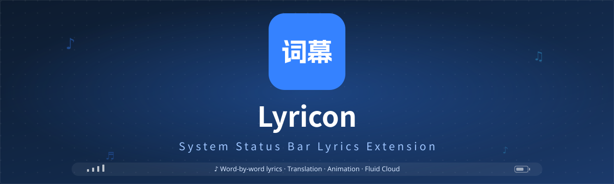

<!--suppress ALL -->

  

  
  

  
  
  
  
  

  

An Android status bar lyrics tool based on Xposed / LSPosed, showing the currently playing lyrics
right in the system status bar.

---

## Features

- ✨ **Customization** — Powerful text, icon and animation customization
- 🎵 **Lyrics** — Word-by-word lyrics, translations, multi-voice and duet display
- 🤖 **AI Translation** — OpenAI-compatible APIs with a local translation cache
- 🧩 **Plugin Extensions** — Easily adapt to different music players
- 📱 **ColorOS Capsule** — Dedicated width and icon-hide options for the fluid cloud
- 💾 **Backup & Restore** — Export and restore configurations in one tap

---

## Installation

**Requirements**: Android 9.0 (API 28) or later, with Root access and LSPosed (or a compatible
Xposed framework).

1. Download and install Lyricon from [Releases](https://github.com/tomakino/lyricon/releases).
2. Enable the Lyricon module in LSPosed and select the **System UI** scope.
3. Restart System UI or reboot the device.
4. Install the [LyricProvider](https://github.com/tomakino/LyricProvider) plugin for your player.
5. Open Lyricon and adjust the anchor, width and visual style.
6. Play a song and verify the status bar.

> The latest stable version of LSPosed is recommended; if lyrics fail to appear, restart System UI
> first.

---

## Ecosystem

| | Link | Description |
|:--|:--|:--|
| **Plugin Library** | [LyricProvider](https://github.com/tomakino/LyricProvider) | Lyric adapters for mainstream music platforms |
| **Documentation** | [Documentation Center](https://tomakino.github.io/lyricon/) | App usage and plugin integration guides |

### Natively Supported Players

[光锥音乐](https://coneplayer.trantor.ink/) · Flamingo · [BBPlayer](https://bbplayer.roitium.com/) · MobiMusic · [Kanade](https://github.com/rcmiku/Kanade) · Sollin Player · [QZ Music](https://github.com/lqtmcstudio/QZMusic) · [棉花音乐](https://github.com/pure-music/PureMusic) · Smart Music Next · [LunaBeat](https://github.com/2755337087/LunaBeat)

Missing your player? [Open an issue](https://github.com/tomakino/lyricon/issues).

---

## Community

[QQ Group](https://qm.qq.com/q/IXif8Zi0Iq) · [Telegram](https://t.me/cslyric)

---

## Credits

---

  Apache-2.0 License · Copyright © 2026 Proify, Tomakino

