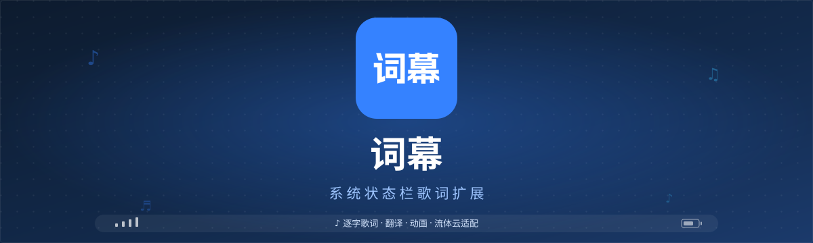

<!--suppress ALL -->

  

  
  

  
  
  
  
  

  

基于 Xposed / LSPosed 的 Android 状态栏歌词工具，将正在播放的歌词实时显示在系统状态栏。

---

## 功能特性

- ✨ **自定义** — 强大的文字、图标、动画自定义功能
- 🎵 **歌词** — 逐字歌词、翻译、多重唱、对唱展示
- 🤖 **AI 翻译** — OpenAI 兼容接口，自动缓存翻译结果
- 🧩 **插件扩展** — 轻松适配不同音乐播放器
- 📱 **ColorOS 流体云** — 流体云场景独立宽度与图标隐藏
- 💾 **备份与恢复** — 一键导出、恢复配置

---

## 安装

**环境要求**：Android 9.0（API 28）及以上，Root 权限与 LSPosed（或兼容的 Xposed 框架）。

1. 从 [Releases](https://github.com/tomakino/lyricon/releases) 下载并安装词幕。
2. 在 LSPosed 中启用词幕模块，作用域选择 **系统界面（System UI）**。
3. 重启 System UI 或重启设备。
4. 安装对应播放器的 [LyricProvider](https://github.com/tomakino/LyricProvider) 插件。
5. 打开词幕，调整锚点、宽度与视觉样式。
6. 播放歌曲，验证状态栏歌词。

> 建议使用 LSPosed 最新正式版本；歌词显示异常时，优先重启 System UI。

---

## 生态

| | 链接 | 说明 |
|:--|:--|:--|
| **插件库** | [LyricProvider](https://github.com/tomakino/LyricProvider) | 主流音乐平台的歌词适配插件 |
| **开发文档** | [文档中心](https://tomakino.github.io/lyricon/) | App 使用与插件接入指南 |

### 原生适配的播放器

[光锥音乐](https://coneplayer.trantor.ink/) · Flamingo · [BBPlayer](https://bbplayer.roitium.com/) · MobiMusic · [Kanade](https://github.com/rcmiku/Kanade) · Sollin Player · [QZ Music](https://github.com/lqtmcstudio/QZMusic) · [棉花音乐](https://github.com/pure-music/PureMusic) · Smart Music Next · [LunaBeat](https://github.com/2755337087/LunaBeat)

没有你的播放器？[提交 issue](https://github.com/tomakino/lyricon/issues)。

---

## 社区

[QQ 交流群](https://qm.qq.com/q/IXif8Zi0Iq) · [Telegram](https://t.me/cslyric)

---

## 致谢

---

  Apache-2.0 License · Copyright © 2026 Proify, Tomakino

